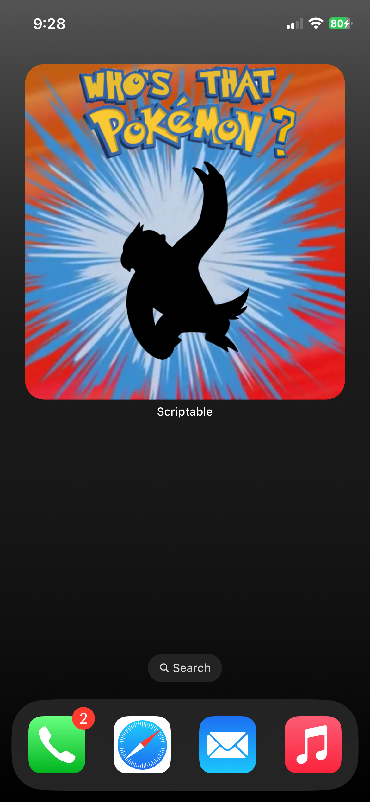
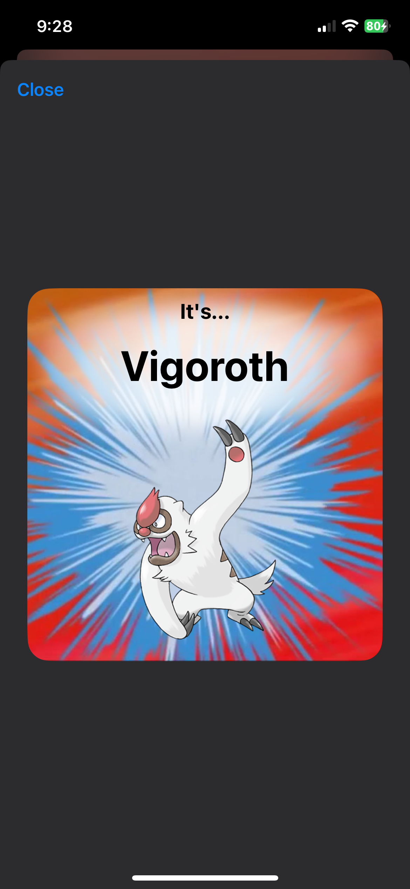

# Who's That Pokémon? - Scriptable Widget

A script for the Scriptable app that runs as a widget on the iOS home screen.  
It can also run as a widget on iPadOS and macOS if you have the Scriptable app for those devices as well.

 

## Table of Contents

- [Features](#features)
- [Installation](#installation)
- [Usage](#usage)
- [License](#license)

## Features

- Will display a silhouette of a Pokémon in a widget and when the user taps it, it reveals which Pokémon it is.
- Works with small, medium, and large widget sizes.
- Has an offline mode.
- Utilizes the Scriptable app and the PokéAPI.

## Installation

Make sure that you have the [Scriptable](https://apps.apple.com/us/app/scriptable/id1405459188) app installed.  
After installing the app, download the .js file linked in this repository. You can download it by clicking the "Go To File" button below, then clicking the "Download raw file" button.  
Once downloaded, move the .js file into the Scriptable folder in your iCloud Drive. You can access your iCloud Drive through the Files app on your iPhone.

<kbd>   [Go To File](./Who's%20That%20Pokémon%3F.js)   </kbd>

Or, if you'd rather, you can copy the code from the .js file and paste it into a new script in the Scriptable editor.

## Usage

Using the script is simple! After it is installed, just add it as a widget to your home screen! You can also tap on the widget to interact with it.
If you encounter an issue, [report a new issue](../../issues) under this repository, if it hasn't already been reported.

## Photos

|  |  |
|:---:|:---:|
